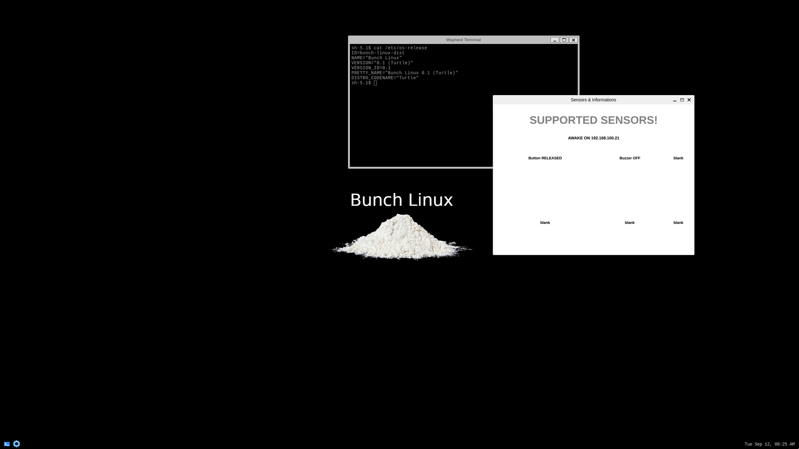
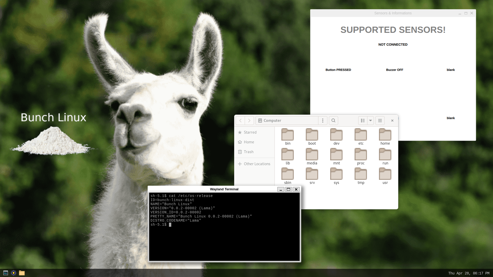

# Changelog
All notable changes to this project will be documented in this file.

## Turtle [0.0.1] -  2023-9-11

### Added
- customize linux boot logo.
- desktop environment configuration.
- add service for buzzer management.
- add service for button management.
- add interprocess communication build with ZeroMQ.
- add network checker service.
- install Qt5 libraries.
- create a basic HMI sensor-app.
- move panel position to bottom

### Note
- first release !

## Lama [0.0.2] -  2023-12-##

wip-preview release pubblished
### Added
- ssh service.
- install wifi driver and test wireless connection.
- install bluetooth driver and test bt connection.
- setup OTA system update.
- replace wallpaper and bar icons.
- setup system update infrastructure.
- include sdk cross compilation tool-chain for Qt5 applications development.
- add a file manager.
- add background image scaling.
- add NTP client.
- remove screensaver.
- update weston to 12.0.3

### Fixed
- grid alignment in sensors-app.

### Known bug
- delay in IPC communications.
- vc4-drm gpu: swiotlb buffer is full reported in kernel buffer.

## Camel [0.0.3] -  2024-##-## 
ideas for future releases
### Ideas
- add a wifi setting app.
- add a bluetooth setting app.
- introduce disk encryption.
- add a screen mirroring service.
- update weston version
- update kernel version
   
### Open points
- disable timer after system update.
