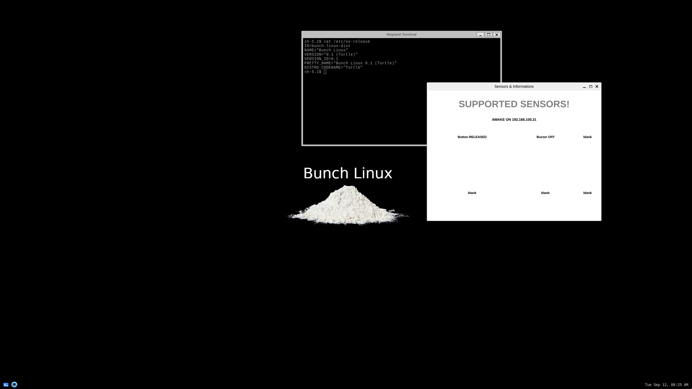

# Changelog
All notable changes to this project will be documented in this file.

## Turtle [0.0.1] -  2023-9-11

### Added
- customize linux boot logo.
- desktop environment configuration.
- add service for buzzer management.
- add service for button management.
- add interprocess communication build with ZeroMQ.
- add network checker service.
- install Qt5 libraries.
- create a basic HMI sensor-app.
- move panel position to bottom

### Note
- first release !

## Lama [0.0.2] -  2023-12-16

### Added
- switch from repo-tool to kas
- add ssh service.
- install wifi driver and test wireless connection.
- install bluetooth driver and test bt connection.
- setup OTA system update.
- replace wallpaper and bar icons.
- setup automatic system update infrastructure.
- include sdk cross compilation tool-chain for Qt5 applications development.
- add a file manager.
- add background image scaling.
- add backwards compatibility for x11 applications.
- add NTP client.
- remove screensaver.
- upgrade sw components.
- add remote access service (rdp,vnc).

## Camel [0.0.3] -  2024-##-## 

### Added 
- porting apps from Qt5 to Qt6
- add [burger-app](https://github.com/waelkarman/burger-shop) 
- add [open-pipe-media-player](https://github.com/waelkarman/open-pipe-media-player)
- upgrade linux kernel from 5.15.x to 6.6.y
- upgrade weston to 13.0.1
- upgrade to Scarthgap
- set up a pipeline for CI/CD
- merge manifest and metalayer to simplify contributions and discussions
- fixed core clock frequencies issue
- first release of the SDK
- add multi-image support (minimal,dev-qt5,dev-qt6,demo)
- use HW acceleration when possible 

   

## - open points & ideas -
- install and configure PipeWire
- implement audio/video routing
- update build system to nanbield
- add a setting app.
- introduce disk encryption.
- add VPN support.
- replace the desktop environment with a custom ones 
- update apps to GTK 4
