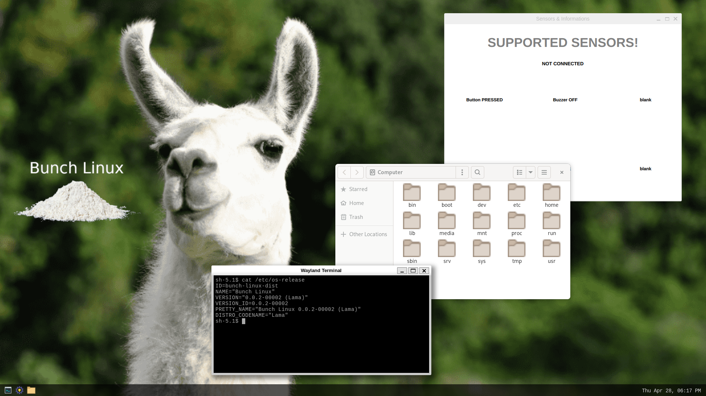

## Bunch linux OS [in development]
it's a project created for just for fun! The aim is to fully understand the foundations of systems and applications starting from the lowest possible level. The idea is to create a fully working alternative to Raspbian OS.  
 
Go to the [official webpage](https://waelkarman.github.io/bunch-linux-manifests/) for more informations.
Link to [bunch-linux-metalayer](https://github.com/waelkarman/bunch-linux-metalayer).

Just for fun !

- Yocto ~ kirkstone
- C
- C++/17
- Qt6/QML
- Python3
- Cmake
- SQLite3
- Bash scripts
- GStreamer
- GTK+3
- ZeroMQ
- POSIX thread
- GNUTools
- Kernel drivers
- Rauc 

# Build and run
Instruction on the [official webpage](https://waelkarman.github.io/bunch-linux-manifests/)
