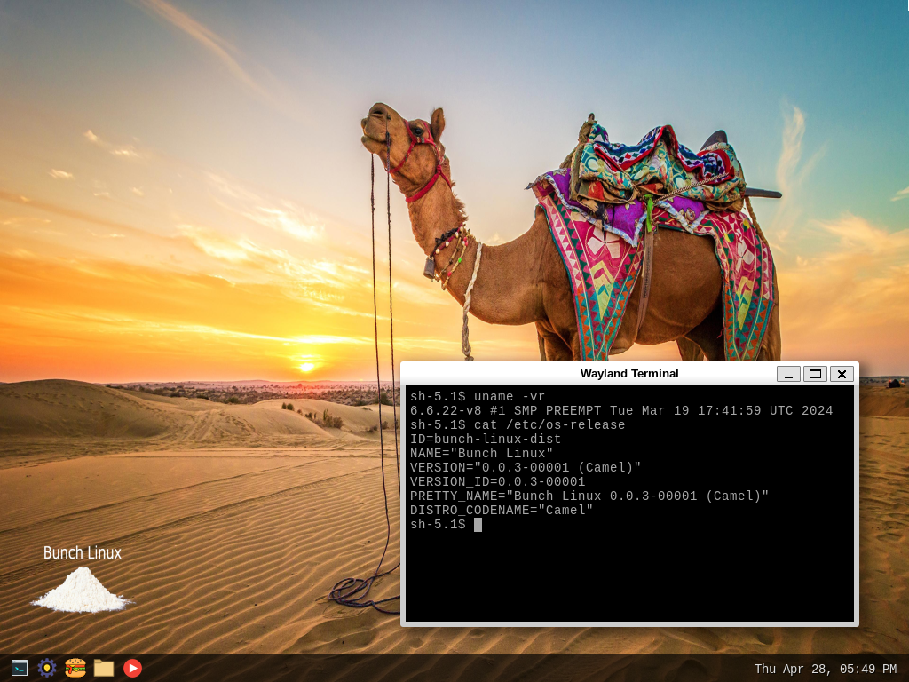
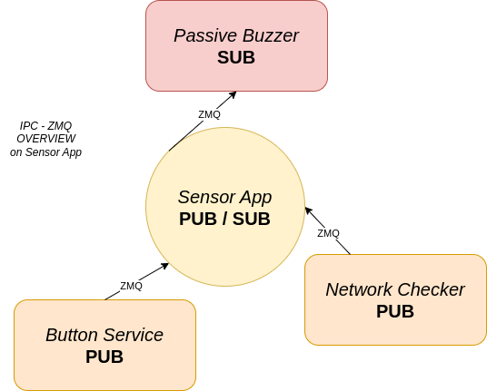
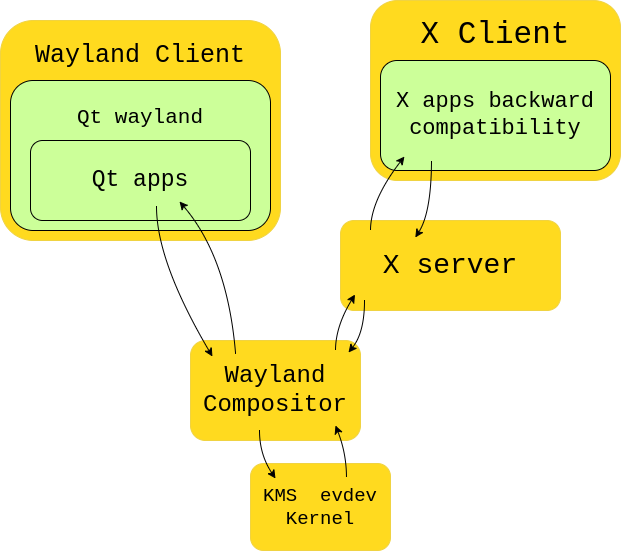
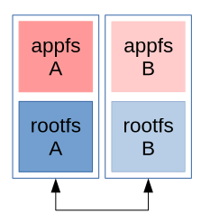

# Welcome to Open Bunch Linux OS ~ Camel (v0.003 - preview) 

Bunch Linux is a project created to fully understand the foundations of systems and applications starting from the lowest possible level. The idea is to create a fully working alternative to Raspbian OS. The goal is to learn as much as possible and of course, have fun!

To get an overview about current and future state refer to the [CHANGELOG.md](https://github.com/waelkarman/bunch-linux-manifests/blob/main/CHANGELOG.md) .

Bunch Linux is slowly getting way more customized by adding new features, install new apps and support more sensors. The project targets to be working out of the box. The sources had been defined in the bunch-linux.yml manifest and will be collected by *KAS* *tool* that will download what is needed and start the building process. 

## System
The system runs the 6.6.y version of the linux kernel and U-Boot is used to handle the boot sequence. *Systemd* is raising the userspace up and all the startup services are depending on the *multi-user.target*.
To view the entire system services, please use the following command:  
> systemctl list-units --type=service --all  

System configuration and boot sequence deeply documented at: 

- [bunch-linux-boot-sequence](https://github.com/waelkarman/bunch-linux-boot-sequence) (dts, Kconfig)

## Topics 
As highlighted, the primary goal is to grasp the essential principles of applications, their domain and their interaction with the system. This involves a proactive effort to integration of various types of applications and to thoroughly understand their functioning within the system. 
The distro comprises the following topic:

- Linux kernel 6.6.y
- Yocto ~ kirkstone
- C
- C++/17
- Qt6/QML
- Python3
- Cmake
- SQLite3
- Bash scripts
- GStreamer
- GTK+3
- ZeroMQ
- POSIX thread
- Kernel drivers
- Rauc Update

## Desktop environment
The system combines several other repos such as:

- [burger-app](https://github.com/waelkarman/burger-shop) (C++\17, Qt6/QML, SQLite3)
- [sensors-app](https://github.com/waelkarman/sensors-app) (C++\17, Qt6/QML)
- [open-pipe-media-player](https://github.com/waelkarman/open-pipe-media-player) (C, GStreamer, GTK+3) 
- [passivebuzzer-service](https://github.com/waelkarman/passivebuzzer-service) (Python3)
- [button-service](https://github.com/waelkarman/button-service) (C++/17)
- [networkchecker-service](https://github.com/waelkarman/networkchecker-service) (Python3)
- [auto-update-service](https://github.com/waelkarman/bunch-linux-manifests/blob/main/meta-bunch-linux%2Frecipes-core%2Fbunch-update%2Fbunch-update%2Fbunch-update.sh) (Bash Script)
- [custom-kernel-modules](https://github.com/waelkarman/kernel-modules) (C)

Services and applications are exchanging messages through a flexible and low latency interprocess communication mechanism based on [ZeroMQ](https://zeromq.org/). This way applications written with any language could exchange rapidly information and work as a single application. The interesting aspect of ZMQ is that the message exchanging mechanism is based on network protocols and that allows to any node over the network to be reached even nodes not defined on the localhost itself like cloud applications for example.  

The following are messages exchanging models that had been tested into the system: 
- Request – Reply 
- Publish – Subscribe 

In the following diagram the summary of the communication layout implemented into the sensors-app is shown.

Wiring: 
> GPIO[17] for Passive Buzzer signal 
> GPIO[18] for Button Signal 

The *sensor-app* has a grid and each supported sensor have a spot in the grid. The sensor-app allows the user to check the status of the supported sensors and control them directly from the UI. For example connecting a button as aforementioned, and pressing it, is possible to read on the sensors-app the state of the button as Pressed/Released furthermore touching on the sensor-app the spot reserved to the passive buzzer the buzzer will ring.

The sensors-app is written in Qt6/QML. The services are implemented in Python3 and C++. The services written in Python3 rely on the pi-blaster and raspi-gpio libraries to interact with the sensors while the services written in C++ utilize a custom library that directly interact with the sys-fs to control the GPIOs and mainly performs the following operations:
> echo [numGPIO] \> /sys/class/gpio/export 
> echo out > /sys/class/gpio/gpio[numGPIO]/direction 
> echo 1 > /sys/class/gpio/gpio[numGPIO]/value 

#### HMI ~ Wayland & xWayland
The HMI is based on the native weston interface with some customization. To support app built for X Windows System, xwayland has been installed allowing X11 applications (like Nautilus) to work within the Wayland protocol. Xwayland acts like a wayland node and implements an X11 server that works as a proxy. Furthermore *QtWayland* is installed to allow Qt6 applications to be managed by the compositor.

#### Remote access

Bunch-Linux installs a remote access feature (based on VNC) through which it is possible to access the system from the development machine and control the system remotely. This functionality is useful when conducting tests without access to a monitor, and in conjunction with the system's Over-The-Air (OTA) update capability, it allows full remote control of the system for development purposes.

## LOCAL & OTA System UPDATE 
For going through the development process a fundamental step is to set-up a proper update process. A/B partitions look like a good choice for separating rootfs and be able to update the system without any loss of data.  

The system is capable of automatic self-updating via OTA (Over-The-Air). It is initialized with two valid root partitions. Upon an update occurs the system is automatically installing the update into the inactive partition and switch the boot pointer to the updated ones. This way an older version of the system is always kept installed and used as fallback option in case the update process went wrong. 
The update service is checking constantly whether an update is available and is keeping the system updated. All updates will be applied after reboot.

The update process is performed by RAUC and the entire update process is connected to the [bunch-linux-manifest](https://github.com/waelkarman/bunch-linux-manifests) repo. The [auto-update-service](https://github.com/waelkarman/bunch-linux-manifests/blob/main/meta-bunch-linux%2Frecipes-core%2Fbunch-update%2Fbunch-update%2Fbunch-update.sh) is regurarly checking the [bunch-update.json](https://github.com/waelkarman/bunch-linux-manifests/blob/main/docs/bunch-update.json) and reading it's attributes. Comparing the incoming attributes with the current ones, the service recognize whether a newer version of the system has been released. In that case, the *url* field of the downloaded json (that points to the release section of this repo) will be used to download the update bundle and subsequently update the system.

## Media
[WORK IN PROGRESS] 

## Connectivity
Wifi and Bluetooth setting-app still not available but wifi connection is working setting it up manually: 

modify the network credentials in /etc/wpa_supplicant.conf :

> ctrl_interface=/var/run/wpa_supplicant 
> ctrl_interface_group=0 
> update_config=1 
> 
> network={ 
>         ssid="insert here your SSID" 
>         scan_ssid=1 
>         key_mgmt=WPA-PSK 
>         psk="insert here your password" 
> } 

Restart wpa_supplicant@wlan0 service  

> systemctl restart wpa_supplicant@wlan0

## Build on your host machine
Tested host configuration: 
Host machine:  
- Ubuntu 20.04.6 LTS (Focal Fossa) 
- Debian 12  

Hardware name: 
- Raspberry Pi 4 Model B Rev 1.4 (DT) 

The building process could arise some warning due to some features in development. 
KAS 4 provide an easy way to collect the sources, setup the environment and start the build process. 
Install kas : 
> pip3 install kas 

clone this manifest : 

> git clone \<URL to manifest\> 
> cd  bunch-linux-manifests 

Start the to build the system:  

> git pull  
> kas build kas/bunch-linux-demo.yml --update --force-checkout 

It could take a while depending on the power of the machine used to compile.  

##### Deploy
The compiled image will be located into the build folder at the following path:
> /build/tmp/deploy/images/raspberrypi4-64

Getting the image it should be flashed through linux dd, bmaptool command or using third party software like *BalenaEtcher*, *Raspberry* *Imager*.

> bunzip2 -c bunch-linux-demo-bunch-raspberrypi4-64.wic.bz2 \| sudo dd of=/dev/sda bs=1M  status=progress && sync

> bmaptool copy \<IMAGE\>.wic.gz /dev/sda && sync

##### Development
To get the SDK run :

> kas shell kas/bunch-linux.yml --update --force-checkout 
> bitbake -c populate_sdk bunch-linux-demo  

at the end of the build the SDK will be placed in :
> /build/tmp/deploy/sdk/raspberrypi4-64  
