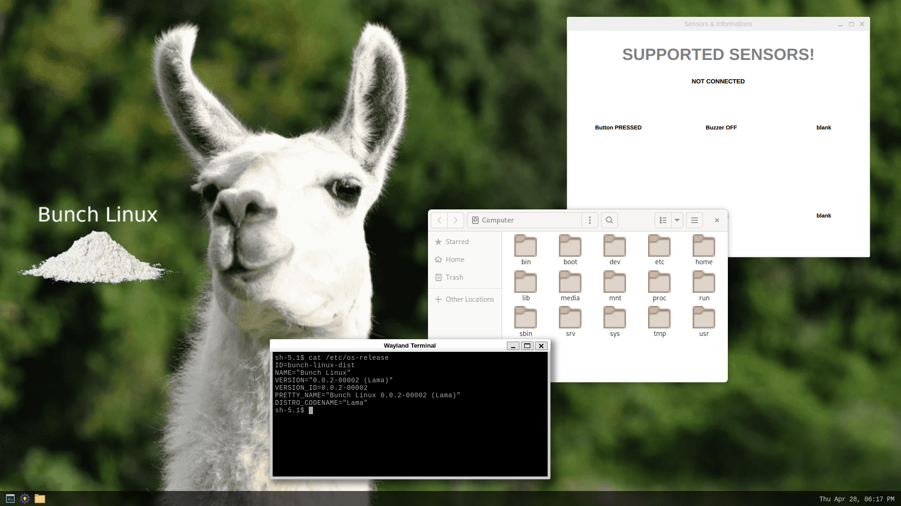

# Welcome to Embedded Bunch Linux OS

Bunch Linux is a project created for learning purposes. The goal is to learn how to build your own custom version of Linux for Embedded Systems as well as the well-known goal of every developer, have fun!
The aim is to fully understand the foundations of systems and applications starting from the lowest possible level. The idea is to create a fully working alternative to Raspbian OS.

To get an overview about current and future state refer to the [CHANGELOG.md](https://github.com/waelkarman/bunch-linux-manifests/blob/main/CHANGELOG.md) .

Bunch Linux is slowly getting way more customized by adding new feature, support more sensors and hardware. The project targets to be working out of the box. The sources had been defined in a manifest and will be collected by *KAS* *project* that will download the sources and setup the directory ready to start building the system. 

## System
The system runs the version 5.15 of the linux kernel and U-Boot is used to handling the boot sequence. *systemd* has been used as the init program and primary data reading and communication services have been added to startup depending on the main target *multi-user.target*.
To view the entire system boot services, you can use the following command:  
> systemctl list-units --type=service --all  

# Integration 
As highlighted, the primary goal is to grasp the essential principles of applications and their interactions with the system. This involves a proactive effort to integrate various types of applications and to thoroughly understand their functioning within the system. So far, the following applications have been successfully integrated: 
1. C/C++ applications 
2. Python applications 
3. Qt/QML applications 
4. Kernel Modules 

#### Integrated Services: 
- passivebuzzer-service (Python)
- gpio-read-sysfs-service (C++)
- networkchecker-service (Python)
- auto-update-service (Shell)

## LOCAL & OTA System UPDATE 
For going through the development process a fundamental step is to set-up a proper update process. A B partitions looks a good choice for separing rootfs and be able to update the system without any loss of data.  

The system is capable of automatic self-updating via OTA (Over-The-Air). It is initialized with two valid root partitions. Upon an update occurs the system is automatically installing the update into the inactive partition and switch the boot pointer to the updated one. This way an older version of the system is always kept installed and used as fallback option in case the update process went wrong. 
The update service is checking constantly whether an update is available and is keeping the system updated. All updates will be applied after reboot.

## HMI
##### Wayland & xWayland

Xwayland is a component of Wayland that allows running X11 applications (designed to work with the X Window System like Nautilus) in a Wayland environment. Xwayland acts as an X11 server within a Wayland environment, enabling X11 applications to function on systems using Wayland as the display server. 

Native weston interface had been customized with some patches to create a nice HMI and *QtWayland* had been installed to allow Qt applications to be managed by the compositor. 

## Remote access

Bunch-Linux installs a remote access feature through which it is possible to access the system from the development machine and control the system remotely. This functionality is useful when conducting tests without access to a monitor, and in conjunction with the system's Over-The-Air (OTA) update capability, it allows full remote control of the system for development purposes.
## Audio 
ALSA + PipeWire, 
aplay and arecord [wip] 

## IPC
##### ZeroMQ
services and applications exchanging messages through a flexible interprocess communication based on [ZeroMQ](https://zeromq.org/). This way applications written with any language could exchange rapidly information and work as a single application. The interesting aspect of ZMQ is that the message exchanging is based on network protocols that allow any node over the network to be reached even cloud applications for example. 
For the specific case, the following are the available messaging exchange models: 
Request–Reply 
Publish–Subscribe 

In the following diagram, the communication schema of the sensors-app already installed on the system is shown.

Similar to any advanced embedded device like an infotainment, a dashboard and so forth the *sensor-app* allows the users to check the status of the supported sensors and to control it directly from the GUI. 

The app is developed in Qt, while the services are implemented in Python and C++. The Python services rely on the pi-blaster and raspi-gpio libraries, while the C++ services utilize a custom library that directly writes to the SYS filesystem of the operating system, corresponding to the following operations:
> echo [numGPIO] \> /sys/class/gpio/export 
> echo out > /sys/class/gpio/gpio[numGPIO]/direction 
> echo 1 > /sys/class/gpio/gpio[numGPIO]/value 

The sysfs interface for PWM was enabled but has been deprecated since Linux kernel version 4.19.

Here are examples of services utilizing interprocess communication (IPC) written in both Python and C++ that are included in the apps: 
* zmq-pubblisher 
* zmq-subscriber 
* zmq-requester 
* zmq-replier 

## Wifi & Bluetooth 
Wifi and Bluetooth setting-app still not available but wifi connection is working setting it up manually: 
- list interfaces: 
> ip link show 
- enable wlan0 interface: 
> ip link set wlan0 up 

add configuration to /etc/wpa_supplicant.conf :

> ctrl_interface=/var/run/wpa_supplicant 
> ctrl_interface_group=0 
> update_config=1 
> 
> network={ 
>         ssid="insert here your SSID" 
>         scan_ssid=1 
>         key_mgmt=WPA-PSK 
>         psk="insert here your password" 
> } 

Activate connection: 

> wpa_supplicant -B -i wlan0 -c /etc/wpa_supplicant.conf 
> udhcpc -i wlan0 

## How to build
Working tested configuration and requirements: 
Host machine:  

> Ubuntu 20.04.6 LTS (Focal Fossa) 
> Debian 12  

Target: 

> RaspberryPi 4 Model B 

Connected GPIO: 
> 17 for Passive Buzzer signal 
> 18 for Button Signal 

Software: 

> Python 3.8.10 
> kas in /usr/local/lib/python3.8/dist-packages (4.0) 
> distro<2,>=1.0.0 in /usr/lib/python3/dist-packages (from kas) (1.4.0) 
> kconfiglib<15,>=14.1.0 in /usr/local/lib/python3.8/dist-packages (from kas) (14.1.0) 
> jsonschema<4,>=2.5.0 in /usr/local/lib/python3.8/dist-packages (from kas) (3.2.0) 
> PyYAML<6,>=3.0 in /usr/lib/python3/dist-packages (from kas) (5.3.1) 
> six>=1.11.0 in /usr/lib/python3/dist-packages (from jsonschema<4,>=2.5.0->kas) (1.14.0) 
> pyrsistent>=0.14.0 in /usr/local/lib/python3.8/dist-packages (from jsonschema<4,>=2.5.0->kas) (0.19.3) 
> setuptools in /usr/lib/python3/dist-packages (from jsonschema<4,>=2.5.0->kas) (45.2.0) 
> attrs>=17.4.0 in /usr/local/lib/python3.8/dist-packages (from jsonschema<4,>=2.5.0->kas) (23.1.0) 

Bunch-Linux a day will become OpenSource but for now is just an experimental system build for learning purpose. Currently to build the system a TOKEN is required. Please ask to the administrator.  
The building process could arise some warning due to some features in development.
### Using KAS project
KAS 4 provide an easy way to collect the sources, setup the environment and start the build process.
Install kas : 

> pip3 install kas 

clone this manifest : 

> git clone \<URL to this repo\> 
> cd  bunch-linux-manifests 

replace \<token\> in the YAML file *kas/bunch-linux.yml*  
Start the to build the system:  

> kas build kas/bunch-linux.yml --update 

It could take a while depending on the machine that are you using for compiling.  

### Deploy
The compiled image will be located into the build folder at the following path:
> /build/tmp/deploy/images/raspberrypi4-64

Getting the image it should be flashed through linux dd, bmaptool command or using third party software like *BalenaEtcher*, *Raspberry* *Imager*.

> bunzip2 -c bunch-linux-bunch-raspberrypi4-64.wic.bz2 \| sudo dd of=/dev/sda bs=1M  status=progress && sync

> bmaptool copy \<IMAGE\>.wic.gz /dev/sda && sync
